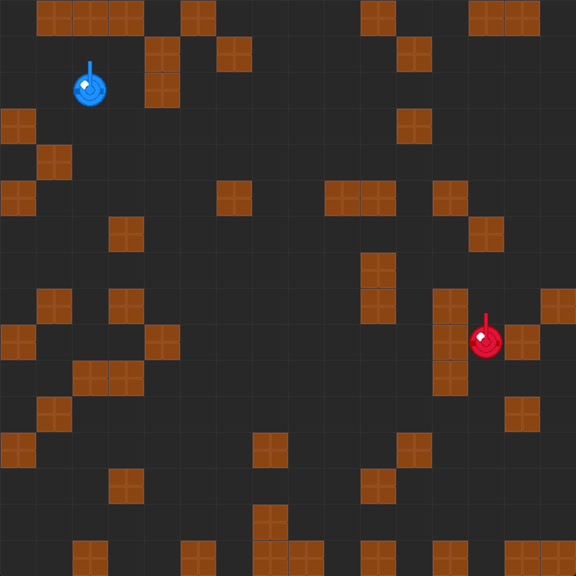

<!-- _class: cover_a -->
<!-- _header: "" -->
<!-- _footer: "" -->
<!-- _paginate: "" -->

# Agent for Tank Battle

###### *Final Presentation*

龙冠澎 姜欣悦 沈博
CS181 Course Project
ShanghaiTech University

## 1. Background & Objectives
<!-- _class: navbar fixedtitleA -->
<!-- _header: \ ***@Tank Battle*** **Background** *Implementation* *Agents* *Experiments* *Summary* -->

- Design an autonomous agent for grid-based tank battle
- Create an interpretable expert policy and integrate deep RL for enhanced performance

### 2.1 Environment Overview
<!-- _class: cols-2-64 navbar -->
<!-- _header: \ ***@Tank Battle*** *Background* **Implementation** *Agents* *Experiments* *Summary* -->

##### Simplified Rules
- A tank performs one action per turn:
  - Move, Turn left, Turn right, Fire, or Stay still
- Bricks are destructible
- A single hit destroys a tank
  

### 2.2 Core Implementation
<!-- _class: navbar fixedtitleA -->
<!-- _header: \ ***@Tank Battle*** *Background* **Implementation** *Agents* *Experiments* *Summary* -->

- Environment: 
  - `SimplifiedEnv` & `SimplifiedInterface` (gym-like API)
- Agent types:
  - `LogicAgent`: rule-based expert
  - `MinimaxAgent`: game-theoretic adversary
  - `PPOAgent`: policy-gradient RL agent

## 3. Agent Design
<!-- _class: navbar fixedtitleA -->
<!-- _header: \ ***@Tank Battle*** *Background* *Implementation* **Agents** *Experiments* *Summary* -->

### Logic Agent (Rule-based Expert)
<!-- _class: cols-2-64 navbar -->
<!-- _header: \ ***@Tank Battle*** *Background* *Implementation* **Agents** *Experiments* *Summary* -->

##### Features

- Uses Z3 solver for planning actions
- Strategy: align → clear obstacle → fire
- No training required; fully interpretable
- Fast inference: executes planning in milliseconds per turn
- Limitations: 
  - No bullet dodging
  - Reactive only

### Minimax Agent  <!-- 极大极小Agent介绍 -->

<!-- _class: navbar fixedtitleA -->
<!-- _header: \ ***@Tank Battle*** *Background* *Implementation* **Agents** *Experiments* *Summary* -->

- Minimax search with default depth = 3
- supports alpha-beta pruning.  <!-- 深度搜索与剪枝 -->
- Pros: anticipates opponent moves for strategic planning.  <!-- 优点: 预测对手行为 -->
- Cons: high computational cost, limited lookahead horizon, no learning component.  <!-- 缺点: 计算量大, 搜索深度受限 -->

### 3.2 Deep RL Agents
<!-- _class: navbar fixedtitleA -->
<!-- _header: \ ***@Tank Battle*** *Background* *Implementation* **Agents** *Experiments* *Summary* -->

#### DQN Agent
- Deep Q-Network with ε-greedy exploration
- Unstable training, slow convergence and low win rate

### 3.2 Deep RL Agents
<!-- _class: navbar fixedtitleA -->
<!-- _header: \ ***@Tank Battle*** *Background* *Implementation* **Agents** *Experiments* *Summary* -->

#### PPO Agent
- Proximal Policy Optimization
- Shared layers + separate policy & value heads
- Clipping and GAE for stable updates
- Outperforms DQN in win rate and convergence speed
- Supports expert reward shaping for guided learning

## 4. Experiments & Results
<!-- _class: navbar fixedtitleA -->
<!-- _header: \ ***@Tank Battle*** *Background* *Implementation* *Agents* **Experiments** *Summary* -->

### 4.1 Technical Contributions
<!-- _class: navbar fixedtitleA -->
<!-- _header: \ ***@Tank Battle*** *Background* *Implementation* *Agents* **Experiments** *Summary* -->

- Logic agent policy: "align → clear obstacle → fire" strategy
- Adversarial training: self-play with expert guidance for robust learning
- PPO integration: policy + value networks, seamless training & evaluation

### 4.2 Optimizations
<!-- _class: navbar fixedtitleA -->
<!-- _header: \ ***@Tank Battle*** *Background* *Implementation* *Agents* **Experiments** *Summary* -->

- Parallel rollouts: multiprocessing to boost sample throughput
- Custom logging: Matplotlib plots saved per training session
- Expert policy integration: Logic agent guides PPO training

## 5. Summary & Future Work
<!-- _class: navbar fixedtitleA -->
<!-- _header: \ ***@Tank Battle*** *Background* *Implementation* *Agents* *Experiments* **Summary** -->

- **Achievements**:
  - Interpretable expert policy
  - Adversarial RL integration
  - Comparative experiments

- **Next Steps**:
  - Bullet-dodging strategy
  - Enhanced opponent modeling

---
<!-- _class: lastpage -->
<!-- _footer: "" -->

###### Thanks for Your Attention!
